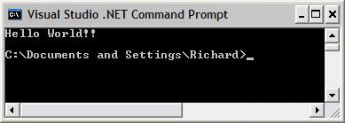



## Console API Class

### Description

Visual Basic doesn't have the ability to read or write from the console. To accomplish this, the Win32 API exports a set of functions that interacts with a console window using handles.

clsWinConsole is a simple VB class that encapsulates the code needed to open, write/read, and close a console window. Here is a code snippet that demonstrates how to use clsWinConsole:

Public Sub Main()

Dim console as New clsWinConsole

Dim inp As String

console.Show

console.WriteText "Text"

inp = console.ReadText

console.WriteText inp

console.Hide

End Sub

 
### More Info
 
Tested with Windows 2000 and Windows XP

             |
---                |---
**Submitted On**   |2002-06-07 23:07:38
**By**             |[Richard Caetano](https://github.com/Planet-Source-Code/PSCIndex/blob/master/ByAuthor/richard-caetano.md)
**Level**          |Intermediate
**User Rating**    |4.7 (33 globes from 7 users)
**Compatibility**  |VB 6\.0
**Category**       |[Windows API Call/ Explanation](https://github.com/Planet-Source-Code/PSCIndex/blob/master/ByCategory/windows-api-call-explanation__1-39.md)
**World**          |[Visual Basic](https://github.com/Planet-Source-Code/PSCIndex/blob/master/ByWorld/visual-basic.md)
**Archive File**   |[Console\_AP91738682002\.zip](https://github.com/Planet-Source-Code/richard-caetano-console-api-class__1-35570/archive/master.zip)

